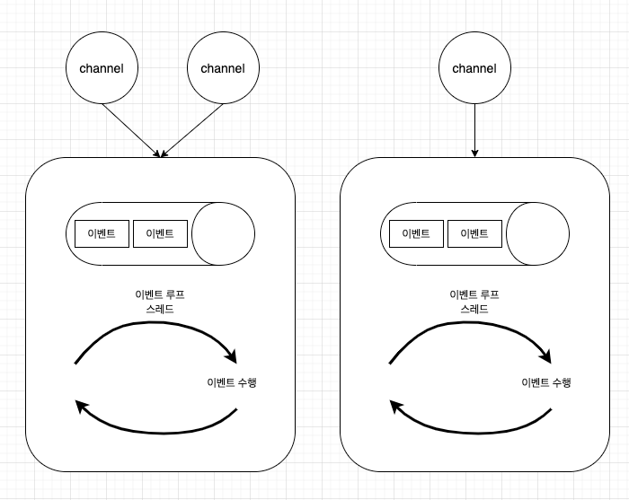

# netty-project

Netty는 네트워크적인 low한 처리와 비즈니스 로직 처리를 추상화를 통해 분리하였으며 덕분에 비즈니스 로직에 더욱 집중할 수 있도록 도와준다. Netty는 크게 다음과 같은 Component들을 통해 데이터를 처리한다.

- Channel, EventLoop, ChannelFuture
- ChannelHandler, ChannelPipeline
- Bootstrap

## ***Channel***

기본 입출력 작업(bind, connect, read, write)은 네트워크 전송에서 제공하는 기본형을 이용한다. 자바 기반 네트워크 기본 구조는 Socket클래스이다. Netty의 Channel 인터페이스는 Socket으로 직접 작업할 때의 복잡성을 크게 완화하는 API를 제공한다. Netty는 Channel 인터페이스를 구현한 몇 가지 특수한 구현체를 제공한다.

- EmbeddedChannel
- LocalServerChannel
- NioDatagramChannel
- NioSctpChannel
- NioSocketChanne

## ***EventLoop***

이벤트 루프란 이벤트를 실행하기 위한 무한루프 스레드를 말한다.

EventLoop는 연결의 수명주기 중 발생하는 이벤트를 처리하는 Netty의 핵심 추상화를 정의한다. 다음은 EventLoop, Thread, EventLoopGroup 간의 관계를 개략적으로 보여준다.

이 설계에서는 한 Channel의 입출력이 동일한 Thread에서 처리되므로 동기화가 필요없다.

위의 그림과 같이 객체에서 발생한 이벤트는 이벤트 큐에 입력되고 이벤트 루프는 이벤트 큐에 입력된 이벤트가 있을 때 해당 이벤트를 꺼내서 이벤트를 실행한다. 이것이 이벤트 루프의 기본 개념이다. 이벤트 루프는 지원하는 스레드 종류에 따라서 단일 스레드 이벤트 루프와 다중 스레드 이벤트 루프로 나뉘고, 이벤트 루프가 처리한 이벤트의 결과를 돌려주는 방식에 따라서 **콜백 패턴**과 **퓨처 패턴**으로 나뉜다. Netty는 이 두 가지 패턴을 모두 지원한다.

- ### **단일 스레드 이벤트 루프**

  단일 스레드 이벤트 루프는 이벤트를 처리하는 스레드가 하나인 상태를 말한다. 이벤트 루프의 구현이 단순하고 예측 가능한 동작을 보장하게 된다. 하나의 스레드가 이벤트 큐에 입력된 이벤트를 처리하므로 이벤트가 발생한 순서를 보장하게 된다. 하지만 멀티 코어 CPU를 효율적으로 사용하지 못하며 특정 이벤트를 처리하는데 blocking이 된다면 다음 이벤트는 이전 이벤트가 처리되기까지 기다려야 한다.

- ### **다중 스레드 이벤트 루프**

  다중 스레드 이벤트 루프는 이벤트를 처리하는 스레드가 여러개인 모델이다. 단일 스레드 이벤트 루프에 비해서 프리엠워크의 구현이 복잡하지만, 이벤트 루프 스레드들이 이벤트 메서드를 병렬로 수행하므로 멀티 코어 CPU를 효율적으로 사용한다. 단점으로는 여러 이벤트 루프 스레드가 이벤트 큐 하나에 접근하므로 **여러 스레드가 자원 하나를 공유할 때 발생하는 스레드 경합이 발생**한다. 또한, 이벤트들이 병렬로 처리되므로 이벤트의 발생 순서와 실행 순서가 일치하지 않게된다.

  다중 스레드 아키텍쳐는 자원의 효율적 사용이라는 장점이 있지만 컨텍스트 스위칭 비용과 스레드 경합이라는 단점도 존재한다. 다중 스레드 어플리케이션에서 스레드들이 하나의 자원을 공유할 때 각 스레드는 공유 자원의 단일 액세스 권한을 획득하려고 스레드 경합을 벌이는데, **스레드 경합은 CPU를 소비하며 스레드가 많아질수록 스레드 경합에 더 많은 CPU자원을 사용하게 됩니다.** 비즈니스 로직에 사용되어야 할 CPU자원이 불필요하게 낭비되는 것이다.

### Netty의 이벤트 루프 모델

Netty는 다중 스레드 이벤트 루프의 단점인 이벤트 발생 순서와 실행 순서의 불일치 문제를 다음과 같이 해결한다.

- **Netty의 이벤트는 Channel에서 발생한다**.
- **각각의 이벤트 루프 객체는 개인의 이벤트 큐를 가지고 있다.**
- **Netty의 Channel은 하나의 이벤트 루프에 등록된다.**
- **하나의 이벤트 루프 스레드에는 여러 채널이 등록될 수 있다.**

Netty의 각 Channel은 위의 그림과 설명에서 말했듯이 개별 이벤트 루프 스레드에 등록된다. 그러므로 채널에서 발생한 이벤트는 항상 동일한 이벤트 루프 스레드에서 처리하여 이벤트 발생 순서와 처리 순서가 일치된다. 다중 스레드 이벤트 모델에서 이벤트의 실행 순서가 일치하지 않는 근본적인 이유는 **이벤트 루프들이 이벤트 큐를 공유하기 때문에 발생하는데 Netty는 이벤트 큐를 이벤트 루프 스레드의 내부에 둠으로써 실행 순서 불일치의 원인을 제거한 것이다.**

### 주의할 점

위의 이벤트 루프 모델을 잘 살펴보면 Netty를 이용하여 개발 할 때 주의해야할 점이 한 가지 있다. 바로 이벤트 루프 스레드가 blocking되면 안되는 것이다. 이벤트 루프 스레드가 blocking되어 버리면 해당 이벤트 루프에 등록된 Channel들에서 발생한 이벤트들이 제때 처리되지못하고 요청들이 밀려버리는 상황이 발생한다. Netty는 이벤트들을 처리하기 위해 ChannelPipeline에 여러 ChannelHandler를 등록하고 이 ChannelHandler들을 chaining하여 이벤트들이 처리된다.

Netty는 이벤트 루프가 blocking되지 않게 blocking구간이 있는 ChannelHandler를 다음과 같이 별도의 EventExecutor에서 실행될 수 있도록 지원한다.

## ***ChannelFuture***

Netty의 모든 입출력 작업은 비동기적이다. 이를 위해 Netty는 ChannelFuture를 제공하며, 이 인터페이스의 addListener() 메서드는 작업이 완료되면(성공 여부와 관계없이) 알림을 받을 ChannelFutureListener 하나를 등록한다.

## ***ChannelHandler***

Application을 개발하는 관점에서 Netty의 핵심 Component는 인바운드와 아웃바운드 데이터의 처리에 적용되는 모든 Application 논리의 컨테이너 역할을 하는 ChannelHandler이다. ChannelHandler의 메서드가 네트워크 이벤트에 의해 트리거 되기 때문이다. 실제로 ChannelHandler는 데이터를 다른 포맷으로 변환하거나 작업 중 발생한 예외를 처리하는 등 거의 모든 종류의 작업에 활용할 수 있다. 그 예로, 우리가 자주 구현하는 ChannelHandler의 하위 인터페이스인 **ChannelInboundInterface**가 있다. 이 인터페이스는 Application으로 들어오는 데이터에 의해 트리거되어 메서드가 호출된다.

## ***ChannelPipeline***

ChannelPipeline은 ChannelHandler 체인을 위한 컨테이너를 제공하며, 체인 상에서 인바운드와 아웃바운드 이벤트를 전파하는 API를 정의한다. Channel이 생성되면 여기에 자동으로 자체적인 ChannelPipeline이 할당된다. ChannelHandler는 다음과 같이 ChannelPipeline안에 설치된다.

1. ChannelInitializer 구현체를 ServerBootstrap에 등록한다.
2. ChannelInitializer.initChannel()이 호출되면 ChannelInitializer가 ChannelHandler의 커스텀 집합을 파이프라인에 설치한다.
3. ChannelInitializer는 ChannelPipeline에서 자신을 제거한다.

ChannelHandler는 광범위한 용도를 지원할 수 있게 설계되었으며, ChannelPipeline을 통해 오가는 이벤트(데이터 포함)를 처리하는 모든 코드를 위한 범용 컨테이너라고 할 수 있다. 핵심 하위 인터페이스로는 **ChannelInboundHandler**와 **ChannelOutboundHandler**가 있다. 파이프라인을 통해 이벤트를 이동하는 역할은 Application의 부트스트랩 단계나 초기화 중에 설치된 ChannelHandler가 담당한다. 이들 객체는 이벤트를 수신하고, 구현된 처리 논리를 실행하며, 체인 상의 다음 ChannelHandler로 데이터를 전달한다. **실행되는 순서는 추가된 순서에 의해 결정된다. ChannelPipeline이라고 말할 때는 이러한 ChannelHandler의 정렬된 배치 전체를 의미한다고 보면 된다.**

아웃바운드와 인바운드 작업이 서로 다르다는 것을 감안할 때, 동일한 ChannelPipeline 안에 두 가지 핸들러 범주가 혼합돼 있으면 Netty는 **ChannelInboundHandler**와 **ChannelOutboundHandler**의 구현을 구분하며, 핸들러 간의 데이터 전달이 동일한 방향으로 수행되도록 보장한다.

ChannelHandler를 ChannelPipeline에 추가할 때 ChannelHandler 및 ChannelPipeline 간의 바인딩을 나타내는 **ChannelHandlerContext** 하나가 할당된다. 이 객체는 기본 Channel을 가져오는 데 이용할 수 있지만, 실제로는 아웃바운드 데이터를 기록할 때 주로 이용된다.

Netty에서 메시지를 보내는 데는 Channel에 직접 기록하거나 ChannelHandler와 연결된 ChannelHandlerContext 객체에 기록하는 두 가지 방법이 있다. 전자는 ChannelPipeline에 끝단에서 시작되며, 후자는 메시지를 기록한 핸들러의 다음 핸들러에서 시작된다.

**인코더와 디코더도 ChannelHandler 인터페이스의 구현체이며 Binary 데이터를 Application에서 사용할 포맷에 맞게 변환하거나 Application의 포맷을 Binary 데이터로 변환하여 출력하는 로직에 사용된다.**

## ***Bootstrap***

Netty의 부트스트랩 클래스는 프로세스를 지정된 포트로 바인딩하거나 프로세스를 지정된 호스트의 지정된 포트에서 실행 중인 다른 호스트로 연결하는 등의 일을 하는 Application의 네트워크 레이어를 구성하는 컨테이너를 제공한다. 부트스트랩에는 클라이언트용과 서버용의 두 가지 유형이 있으며 다음과 같다.

- Bootstrap (클라이언트용)
- ServerBootstrap (서버용)

